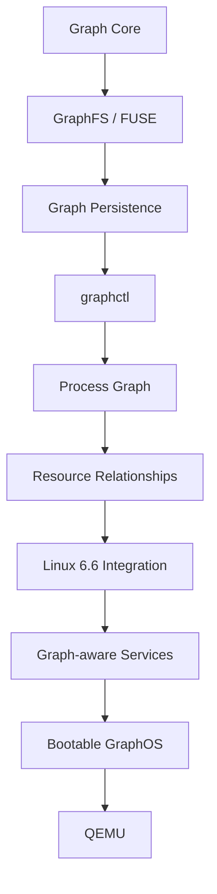
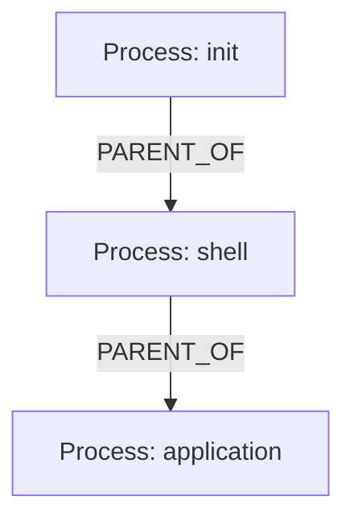
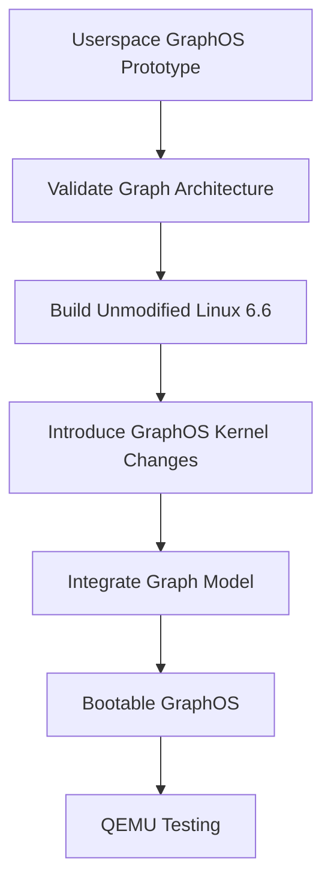
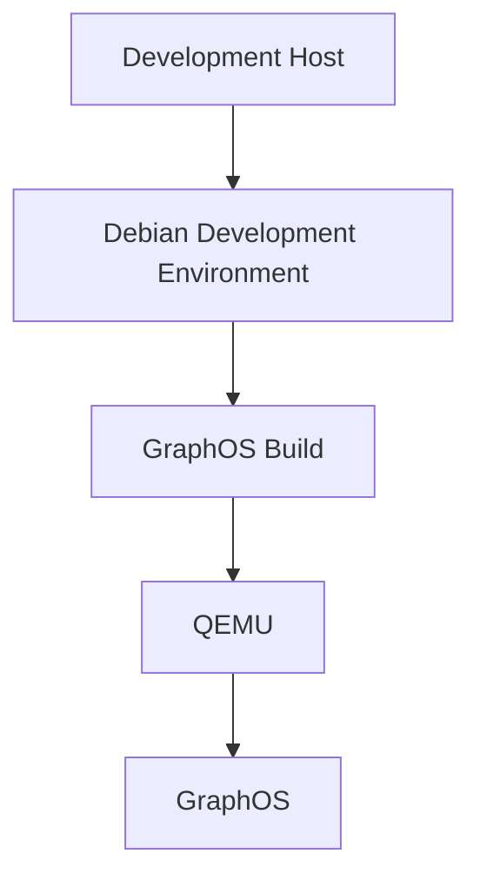

# GraphOS Development Roadmap

## 1. Overview

GraphOS will be developed incrementally, beginning with a userspace prototype and progressively integrating graph concepts deeper into the operating system.

The initial development target is a functional graph-backed filesystem and process graph.

---

## 2. Development Architecture



Each phase should produce a testable result before the next phase begins.

---

# Phase 1 — Graph Core

## Objective

Implement the fundamental graph data structures and operations.

### Components

- Node
- Edge
- Graph
- Node lookup
- Relationship lookup
- Graph persistence

### Initial Node Types

- SYSTEM
- DIRECTORY
- FILE
- PROCESS

### Initial Edge Types

- CONTAINS
- USES
- PARENT_OF

### Expected Result

A standalone Graph Core implementation capable of creating, modifying, storing, and querying graphs.

---

# Phase 2 — GraphFS

## Objective

Expose the graph through a filesystem interface.

GraphFS will initially use FUSE 3.

### Initial Filesystem Operations

- init
- destroy
- getattr
- readdir
- mkdir
- create
- open
- read
- write
- unlink
- rename

Operations will be implemented incrementally.

### Expected Result

A user should be able to mount GraphFS and interact with graph-backed directories and files using normal filesystem commands.

Example:

```text
mkdir projects
touch projects/hello.txt
```

The corresponding objects should exist in the GraphOS graph.

---

# Phase 3 — Graph Persistence

## Objective

Ensure that the graph can survive process termination and remounting.

Initial persistent storage may contain:

```text
storage/
├── nodes.dat
└── edges.dat
```

Runtime data should not be committed to Git.

### Expected Result

Unmounting and remounting GraphFS should restore the graph and its stored relationships.

---

# Phase 4 — graphctl

## Objective

Provide a command-line interface for inspecting the graph.

### Initial Commands

```text
graphctl nodes
graphctl edges
graphctl tree
graphctl info <ID>
```

### Future Commands

```text
graphctl processes
graphctl resources
graphctl services
graphctl inspect
```

### Expected Result

Users can inspect the internal GraphOS graph without directly accessing internal storage files.

---

# Phase 5 — Process Graph

## Objective

Represent Linux processes as graph nodes.

The initial implementation will use the Linux `/proc` filesystem.

Important information includes:

- Process ID
- Process name
- Parent process
- Process state

### Process Relationships



### Expected Result

The running Linux process hierarchy can be represented as a graph.

---

# Phase 6 — Resource Relationships

## Objective

Represent relationships between processes and system resources.

The initial implementation can inspect:

```text
/proc/<pid>/fd/
```

to identify resources associated with processes.

### Example


### Expected Result

The graph contains both processes and selected process-to-resource relationships.

---

# Phase 7 — Linux 6.6 Integration

## Objective

Begin integrating GraphOS concepts into the Linux kernel.

The first step is to build and validate an unmodified Linux 6.6 kernel successfully.

GraphOS functionality is then introduced incrementally.

### Potential Integration Areas

- VFS
- Process management
- Files
- Devices
- Networking
- IPC
- Resource management

### Integration Strategy



### Expected Result

Graph concepts begin becoming part of the operating-system implementation rather than remaining entirely in userspace.

---

# Phase 8 — Graph-Aware System Services

## Objective

Extend graph-based relationships to additional operating-system resources.

Potential areas include:

- Processes
- Files
- Devices
- Memory
- CPU
- Networking
- Services
- Applications
- IPC

The exact model will be determined by implementation requirements and testing.

### Expected Result

GraphOS can represent increasingly complex relationships between system components.

---

# Phase 9 — Bootable GraphOS

## Objective

Create a bootable GraphOS system image.

The system should eventually contain:

- Linux kernel
- GraphOS components
- Initial userspace
- Graph-backed system services

### Expected Result

GraphOS can boot as an operating-system environment rather than only running as a userspace prototype.

---

# Phase 10 — QEMU

## Objective

Run GraphOS as a virtual machine.

The initial target architecture is:

```text
x86-64
```

### Development Environment



### Expected Result

GraphOS successfully boots and operates inside QEMU.

---

# 3. Initial 15-Day Prototype Plan

| Day | Task | Expected Result |
|---|---|---|
| Day 1 | Repository and architecture documentation | Initial project structure and documentation |
| Day 2 | Define Graph Core API and data model | Graph API specification |
| Day 3 | Implement Graph Core | Working graph implementation |
| Day 4 | Implement graph query operations | Node and relationship queries |
| Day 5 | Test Graph Core | Passing Graph Core tests |
| Day 6 | Create GraphFS/FUSE skeleton | FUSE-based filesystem skeleton |
| Day 7 | Implement GraphFS read operations | Filesystem can be inspected |
| Day 8 | Implement GraphFS write operations | Files/directories can be created and modified |
| Day 9 | Implement graph-authoritative path resolution | Paths resolve through graph relationships |
| Day 10 | Implement graph persistence | Graph survives restart/remount |
| Day 11 | Implement graphctl | Graph can be inspected from CLI |
| Day 12 | Implement process graph using `/proc` | Processes represented as graph nodes |
| Day 13 | Implement process-to-resource relationships | Process/resource relationships represented |
| Day 14 | Integrate and test the prototype | Complete userspace prototype |
| Day 15 | Linux validation, testing, documentation, and demonstration | First major prototype milestone |

---

# 4. Initial Milestone

At the end of the initial prototype stage, GraphOS should demonstrate:

- Graph creation
- Persistent graph storage
- Graph-backed filesystem
- FUSE mounting
- Directory creation
- File creation
- File reading
- File writing
- Graph inspection through `graphctl`
- Process nodes
- Process relationships
- Process-to-resource relationships

This milestone validates the fundamental GraphOS architectural concept.

It should not be interpreted as a literal percentage of the final codebase. It is a functional milestone within the larger project.

---

# 5. Long-Term Development Goal

The long-term objective is to move from:


toward an operating system where graph relationships are a fundamental part of how system resources are represented and managed.
