# GraphOS Graph Model

## 1. Purpose

The GraphOS graph model defines the fundamental representation used to describe objects and relationships within the operating system.

The graph consists of:

**Nodes + Edges = Graph**

---

## 2. Node

A node represents an object in GraphOS.

The initial conceptual node structure contains:

- ID
- Type
- Name
- Metadata

### Node Structure

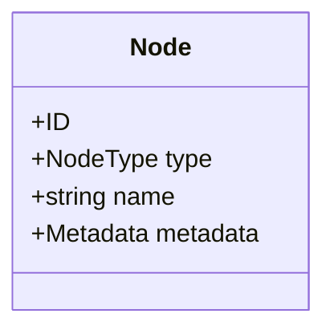

### ID

A unique identifier for the node.

The identifier must allow other nodes and edges to refer to the node unambiguously.

### Type

Defines the category of object represented by the node.

### Name

Human-readable name associated with the object.

### Metadata

Additional information associated with the node.

Metadata should not replace relationships represented by graph edges.

---

## 3. Initial Node Types

The initial prototype uses four node types:

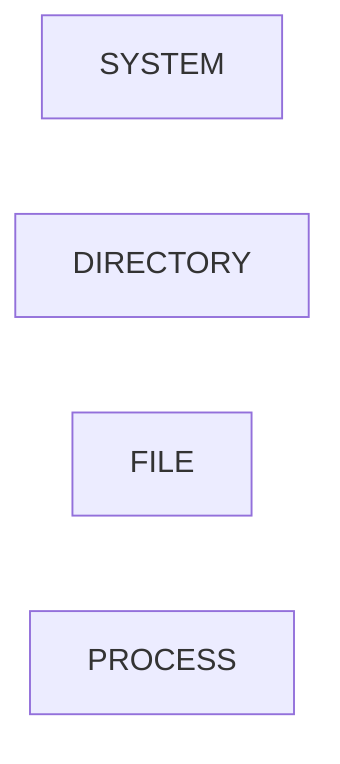

### SYSTEM

Represents the GraphOS system root.

### DIRECTORY

Represents a directory.

### FILE

Represents a file.

### PROCESS

Represents a running process.

---

## 4. Edge

An edge represents a relationship between two nodes.

The conceptual structure is:

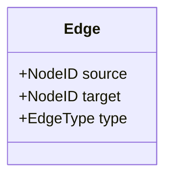

For example:

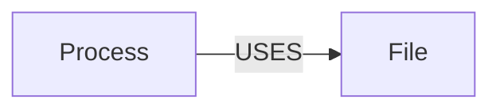

The edge explicitly represents the relationship between the two objects.

---

## 5. Initial Edge Types

### CONTAINS

Represents containment.

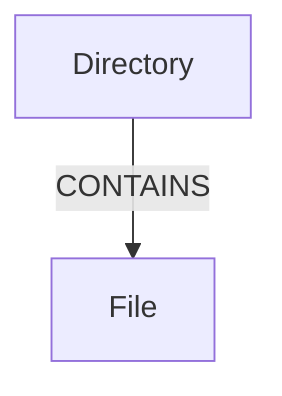

### USES

Represents resource usage or dependency.

### PARENT_OF

Represents a parent-child relationship.

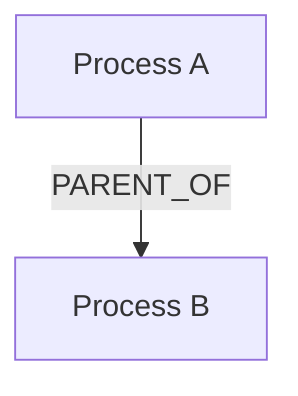

---

## 6. Graph

The Graph object contains the complete set of nodes and edges.

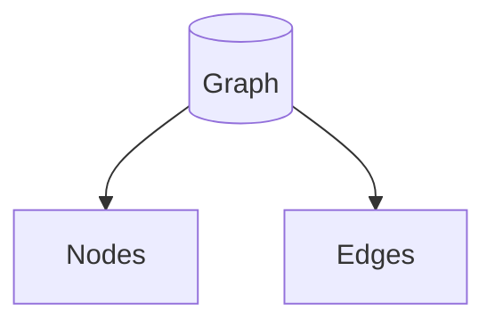

The Graph Core should provide operations for:

- Create graph
- Destroy graph
- Create node
- Delete node
- Create edge
- Delete edge
- Find node
- Find children
- Find parent
- Find node by name

---

## 7. Example Graph

A simple filesystem graph:

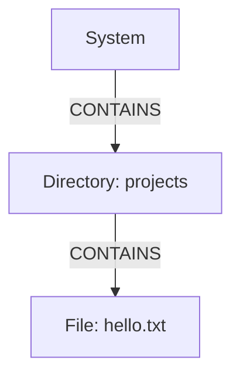

A process graph:

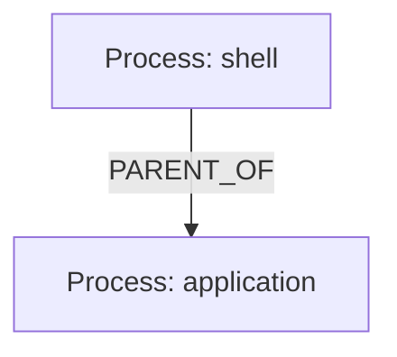

A process-resource relationship:

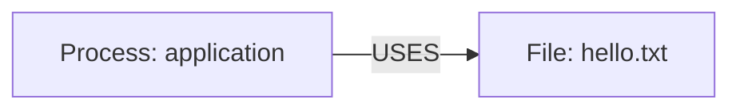

These relationships can exist simultaneously.

---

## 8. Graph Traversal

Filesystem paths can be resolved by traversing graph relationships.

For:

`/projects/hello.txt`

the conceptual traversal is:

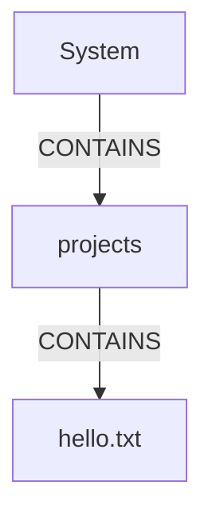

Each path component identifies a node reached through a relationship.

---

## 9. Graph Authority

The long-term architecture treats the graph as the authoritative representation of system relationships.

GraphOS should avoid unnecessarily maintaining two independent sources of truth.

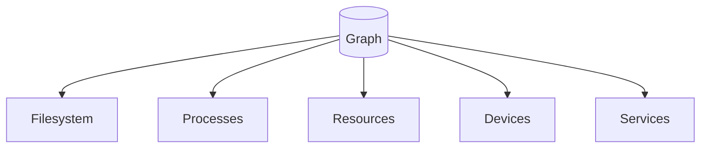

---

## 10. Future Node Types

Additional node types may eventually include:

- DEVICE
- MEMORY
- CPU
- GPU
- NETWORK_INTERFACE
- SOCKET
- SERVICE
- APPLICATION
- USER
- GROUP
- MOUNT
- THREAD

These are not part of the initial prototype.

---

## 11. Future Edge Types

Possible future relationships include:

- OWNS
- DEPENDS_ON
- CONNECTED_TO
- ALLOCATED_TO
- EXECUTES
- MOUNTS
- COMMUNICATES_WITH
- PROVIDES
- CONSUMES
- SCHEDULED_ON

These are future design possibilities and are not requirements for the initial implementation.

---

## 12. Design Constraint

The initial graph model must remain small.

The purpose of the first implementation is to prove that the graph can successfully represent filesystem and process relationships.

Complex resource modeling should be introduced incrementally.
