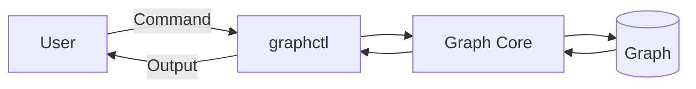
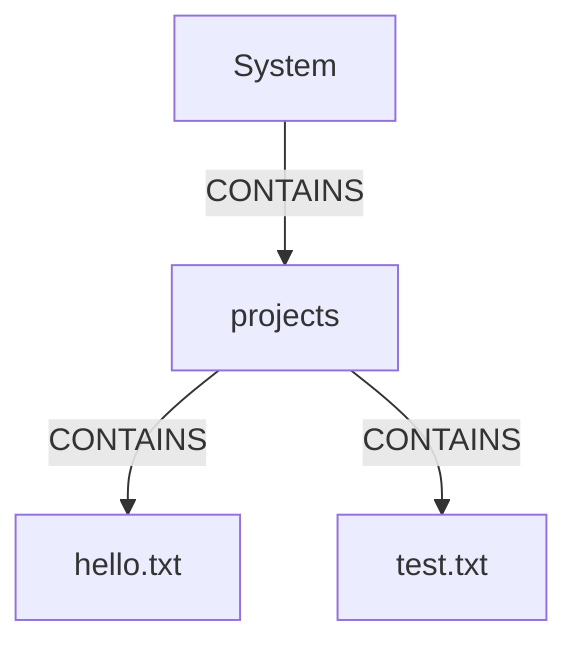
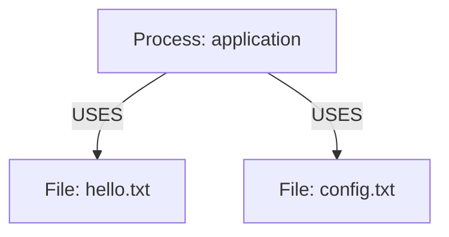
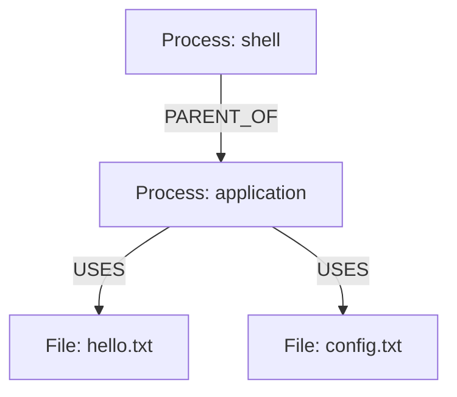
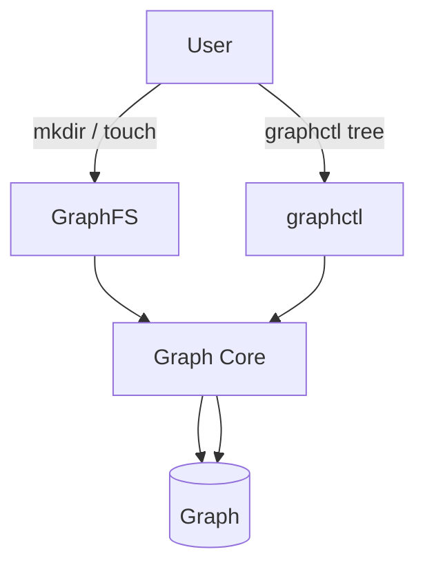
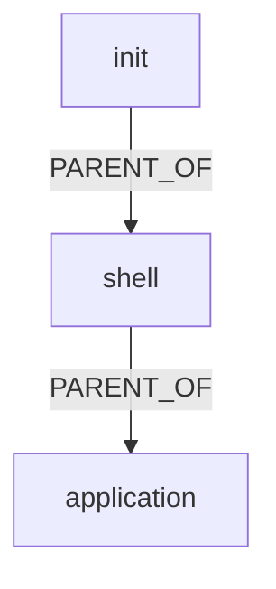
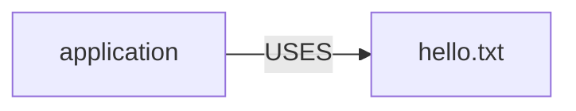

# graphctl

## 1. Overview

`graphctl` is the command-line interface for inspecting and interacting with the GraphOS graph.

It provides developers and users with a human-readable way to examine graph nodes, edges, relationships, and system state.

The initial version is intended primarily as an inspection and debugging tool.

---

## 2. Architecture

`graphctl` communicates with the GraphOS graph layer.



The CLI should not directly manipulate internal graph storage formats.

It should use the Graph Core interface wherever possible.

---

## 3. Initial Commands

The first version should support a small set of commands.

```text
graphctl nodes
graphctl edges
graphctl tree
graphctl info <ID>
```

Additional commands can be introduced after the initial interface is stable.

---

# 4. `graphctl nodes`

## Purpose

Display the nodes currently stored in the GraphOS graph.

### Command

```text
graphctl nodes
```

### Example Output

```text
ID     TYPE       NAME
1      SYSTEM     root
2      DIRECTORY  projects
3      FILE       hello.txt
4      PROCESS    bash
```

The exact formatting may change during implementation.

The command should provide enough information to identify individual nodes.

---

# 5. `graphctl edges`

## Purpose

Display relationships between graph nodes.

### Command

```text
graphctl edges
```

### Example Output

```text
SOURCE   TYPE        TARGET
1        CONTAINS    2
2        CONTAINS    3
4        USES       3
```

The command should make the direction and type of each relationship clear.

---

# 6. `graphctl tree`

## Purpose

Display the graph in a human-readable hierarchical representation.

### Command

```text
graphctl tree
```

### Example Graph



### Example Output

```text
System
└── projects
    ├── hello.txt
    └── test.txt
```

The tree command is primarily intended to make filesystem-related graph relationships easy to understand.

---

# 7. `graphctl info`

## Purpose

Display detailed information about a specific node.

### Command

```text
graphctl info <ID>
```

### Example

```text
graphctl info 3
```

### Example Output

```text
ID: 3
Type: FILE
Name: hello.txt
```

Future versions may display:

- Metadata
- Parent
- Children
- Related processes
- Related resources
- Incoming edges
- Outgoing edges

---

# 8. Node Relationships

A node may have multiple relationships.

For example:



`graphctl info` should eventually make these relationships inspectable.

---

# 9. Future Commands

Future versions may introduce additional commands.

## Process Inspection

```text
graphctl processes
```

Displays process nodes.

---

## Resource Inspection

```text
graphctl resources
```

Displays resource-related nodes and relationships.

---

## Service Inspection

```text
graphctl services
```

Displays service nodes and their relationships.

---

## Graph Inspection

```text
graphctl inspect
```

Provides a more detailed overview of the current graph.

---

## Node Search

A future command may allow searching by node type:

```text
graphctl find --type PROCESS
```

or by name:

```text
graphctl find --name hello.txt
```

The exact syntax will be finalized during implementation.

---

# 10. Command Design Principles

The CLI should follow these principles.

### Predictability

Commands should use consistent syntax.

### Readability

Output should be understandable without knowledge of the internal implementation.

### Scriptability

Where practical, output should eventually support machine-readable formats.

### Stability

Once commands become part of the documented interface, changes should be deliberate and documented.

### Separation

The CLI should use Graph Core interfaces rather than accessing internal graph structures directly.

---

# 11. Error Handling

`graphctl` should provide useful error messages.

Examples include:

```text
Node not found: 42
```

```text
Unknown command: foo
```

```text
Invalid node ID: abc
```

```text
Unable to load graph
```

Errors should be written in a way that allows developers to identify the cause of a problem quickly.

---

# 12. Exit Status

The CLI should use meaningful process exit codes.

A successful command should return:

```text
0
```

Failures should return a non-zero exit status.

The exact error-code scheme can be defined during implementation.

---

# 13. Relationship Inspection

A future version of `graphctl` should allow users to inspect relationships around a node.

For example:



A relationship-oriented command could eventually show:

```text
Parent:
    shell

Uses:
    hello.txt
    config.txt
```

---

# 14. GraphFS Integration

`graphctl` should reflect changes made through GraphFS.

For example, after:

```text
mkdir projects
touch projects/hello.txt
```

the graph should contain corresponding nodes and relationships.

Running:

```text
graphctl nodes
```

should therefore show the newly created objects.

Running:

```text
graphctl tree
```

should show the corresponding structure.



---

# 15. Process Graph Integration

When the process monitor creates PROCESS nodes, `graphctl` should eventually be able to display them.

Example:



A future command such as:

```text
graphctl processes
```

could display the process graph.

---

# 16. Resource Relationship Integration

When process-to-resource relationships are available, `graphctl` should eventually allow them to be inspected.

Example:



This allows developers to investigate relationships that are not visible through a traditional directory tree alone.

---

# 17. Initial Scope

The first implementation should focus on:

```text
graphctl nodes
graphctl edges
graphctl tree
graphctl info <ID>
```

The initial goal is reliable graph inspection.

Process, resource, service, search, and advanced query commands should be added only after the basic interface is working.

---

# 18. Success Criteria

The initial `graphctl` implementation is considered functional when it can:

1. Load the GraphOS graph.
2. List nodes.
3. List edges.
4. Display the graph tree.
5. Display information about a specific node.
6. Correctly reflect changes made through GraphFS.
7. Correctly display process nodes when process monitoring is available.
8. Report errors clearly.
9. Return appropriate exit statuses.

---

# 19. Future Direction

As GraphOS develops, `graphctl` can evolve from a basic inspection utility into a general graph-management and diagnostic interface.

Potential future capabilities include:

- Graph queries
- Filtering
- Relationship traversal
- Resource inspection
- Process inspection
- Service dependency analysis
- Machine-readable output
- Graph export
- Runtime diagnostics

The command-line interface should evolve alongside the GraphOS graph model.
