# GraphFS

## 1. Overview

GraphFS is the filesystem interface of the initial GraphOS prototype.

It provides a conventional filesystem interface while representing filesystem objects and their relationships in the GraphOS graph.

The initial implementation uses FUSE 3.

The purpose of GraphFS is to demonstrate that filesystem operations can be represented through graph operations.

---

## 2. Architecture

The initial GraphFS architecture is:

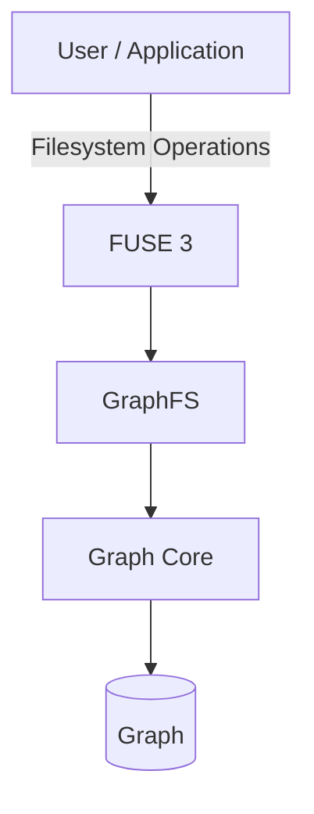

GraphFS should use Graph Core for graph operations rather than maintaining a separate filesystem-specific graph implementation.

---

## 3. Filesystem Objects

The initial filesystem model contains:

- SYSTEM
- DIRECTORY
- FILE

These objects are represented as graph nodes.

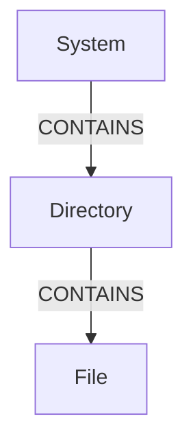

---

## 4. Directory Creation

When a user executes:

```text
mkdir projects
```

GraphFS should create a DIRECTORY node and establish a relationship with its parent.

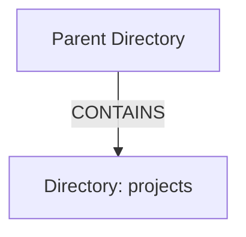

The filesystem directory therefore corresponds to a graph node.

---

## 5. File Creation

When a user executes:

```text
touch hello.txt
```

GraphFS should create a FILE node and connect it to its parent directory.

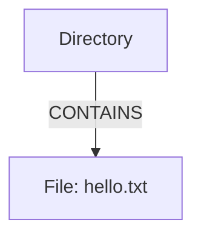

---

## 6. Nested Directories

GraphFS must support relationships between directories.

For example:

```text
mkdir projects
mkdir projects/graphos
touch projects/graphos/README.txt
```

The graph can represent this as:

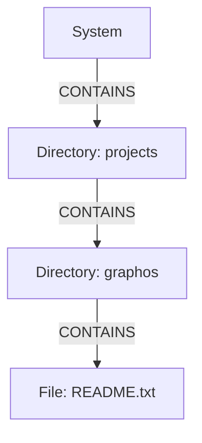

---

## 7. Path Resolution

GraphFS should resolve filesystem paths by traversing graph relationships.

For example:

```text
/projects/graphos/README.txt
```

can be resolved through:

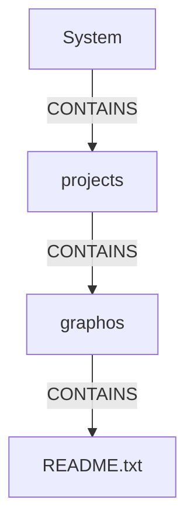

The path components are therefore resolved through graph relationships rather than through an independent filesystem hierarchy.

---

## 8. Graph Authority

The long-term design requires the graph to be the authoritative representation of filesystem relationships.

GraphFS should therefore avoid treating a normal directory tree as a second independent source of truth.

The intended model is:

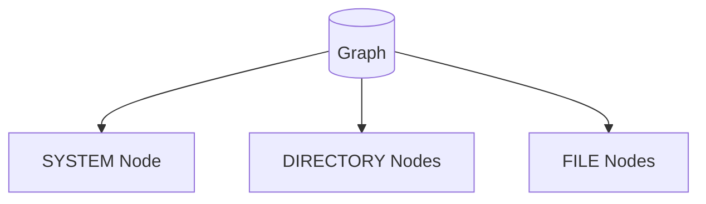

Relationships between these nodes are represented by graph edges.

---

## 9. FUSE Interface

GraphFS initially uses FUSE 3 to expose the graph-backed filesystem to Linux userspace.

The initial implementation should support the following operations:

### Lifecycle

- `init`
- `destroy`

### Reading

- `getattr`
- `readdir`
- `open`
- `read`

### Writing

- `mkdir`
- `create`
- `write`

### File Management

- `unlink`
- `rename`

Operations should be implemented incrementally rather than all at once.

---

## 10. Filesystem Operation Flow

A typical filesystem operation should follow this general flow:

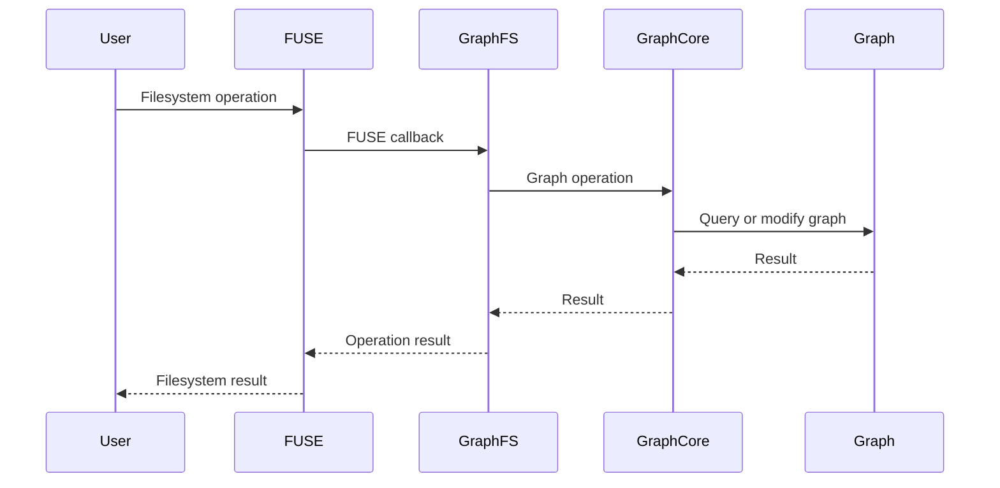

This keeps the graph layer separate from the FUSE interface.

---

## 11. Read Operations

### `getattr`

`getattr` should determine whether a requested graph object exists and return the appropriate filesystem attributes.

The implementation must distinguish between:

- Files
- Directories
- Missing objects

---

### `readdir`

`readdir` should identify the children of a directory by querying the graph.

For example:

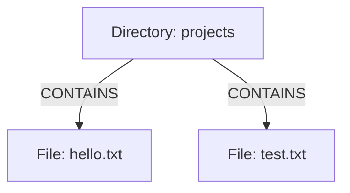

A `readdir` operation should return:

```text
hello.txt
test.txt
```

based on the graph relationships.

---

## 12. Write Operations

### `mkdir`

Creates a DIRECTORY node and a `CONTAINS` edge.

### `create`

Creates a FILE node and a `CONTAINS` edge.

### `write`

Stores file data associated with the corresponding FILE node.

The exact storage mechanism may evolve during development.

---

## 13. File Data

The graph represents the existence and relationships of files.

File contents may be stored separately from graph metadata while remaining associated with the corresponding FILE node.

Conceptually:

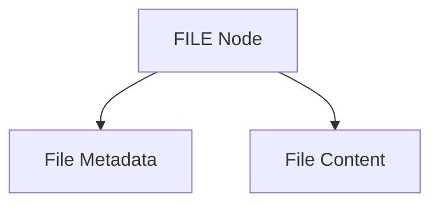

The graph remains authoritative for the existence and relationships of the file.

---

## 14. Deleting Files

When:

```text
rm hello.txt
```

is executed, GraphFS should:

1. Locate the corresponding FILE node.
2. Remove or update the relevant graph relationship.
3. Remove the file's stored data according to the persistence design.
4. Return the appropriate filesystem result.

The implementation must ensure that deleted files do not remain incorrectly reachable through the graph.

---

## 15. Renaming Files

When:

```text
mv hello.txt newname.txt
```

is executed, GraphFS should update the graph representation so that the FILE node is associated with the new name and, if necessary, a different parent directory.

The graph relationships must remain consistent after the operation.

---

## 16. Persistence

GraphFS must eventually persist graph state so that the graph survives process termination and remounting.

Initial storage may use:

```text
storage/
├── nodes.dat
└── edges.dat
```

The exact serialization format may evolve during implementation.

Runtime data should not be committed to the Git repository.

---

## 17. Mount Lifecycle

The intended lifecycle is:

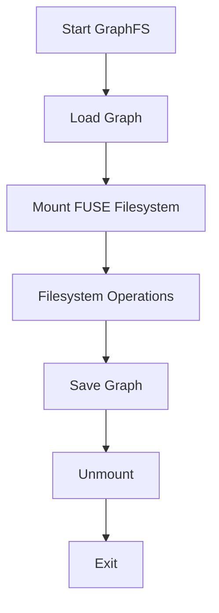

The implementation should ensure that graph state is not lost during normal shutdown.

---

## 18. Initial Success Criteria

GraphFS is considered functional when a user can:

1. Start GraphFS.
2. Mount the filesystem.
3. Create a directory.
4. Create a file.
5. Write data to the file.
6. Read the data back.
7. List the directory.
8. Rename the file.
9. Delete the file.
10. Unmount GraphFS.
11. Restart GraphFS.
12. Recover persistent graph state.

---

## 19. Prototype Scope

The initial GraphFS implementation should remain small.

The first objective is to prove:

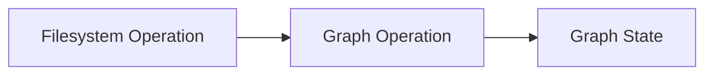

Once this relationship is stable, more advanced filesystem features can be added.

---

## 20. Future Development

Future versions may integrate GraphFS more deeply with Linux VFS and eventually reduce the distinction between GraphOS graph objects and native kernel resources.

Potential future areas include:

- Permissions
- Users
- Groups
- Mount relationships
- Devices
- Sockets
- Network resources
- Extended attributes
- Symbolic links
- File locking
- Memory mapping

These features are outside the initial prototype scope.
