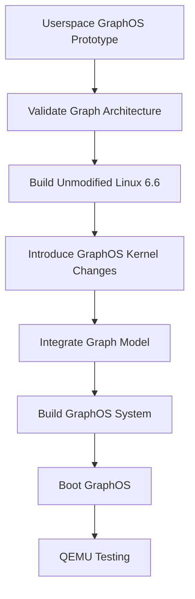
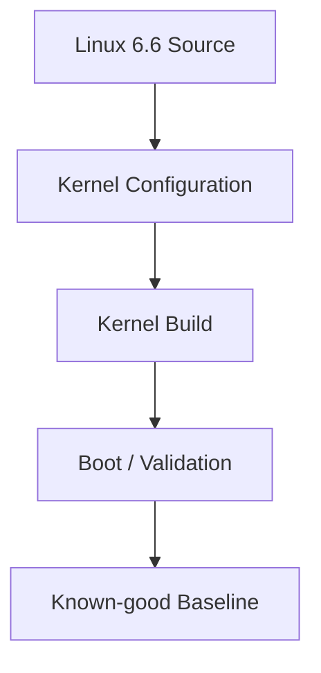
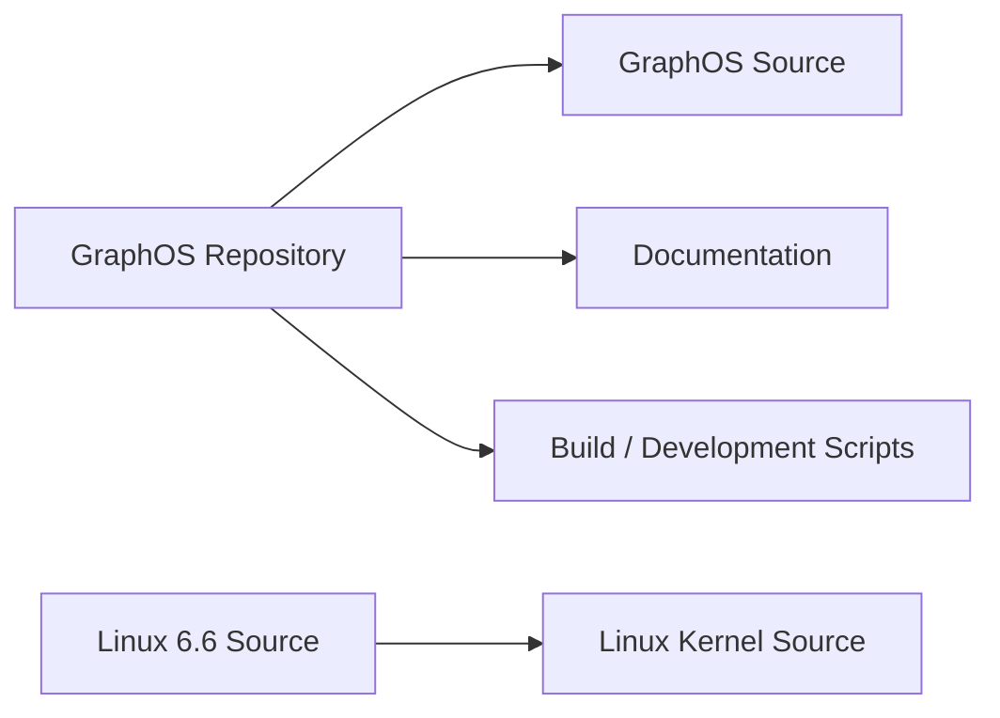
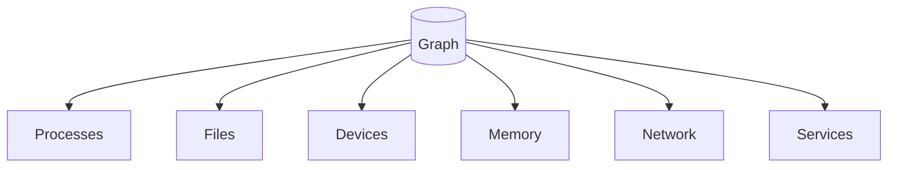
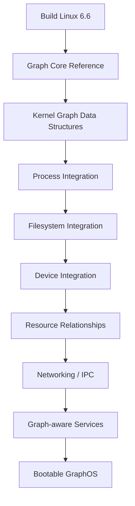
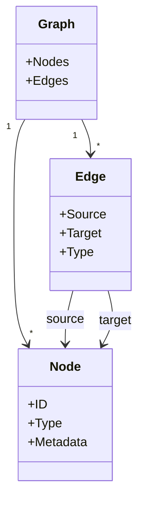
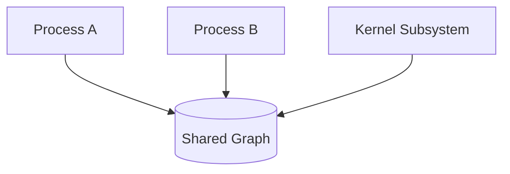
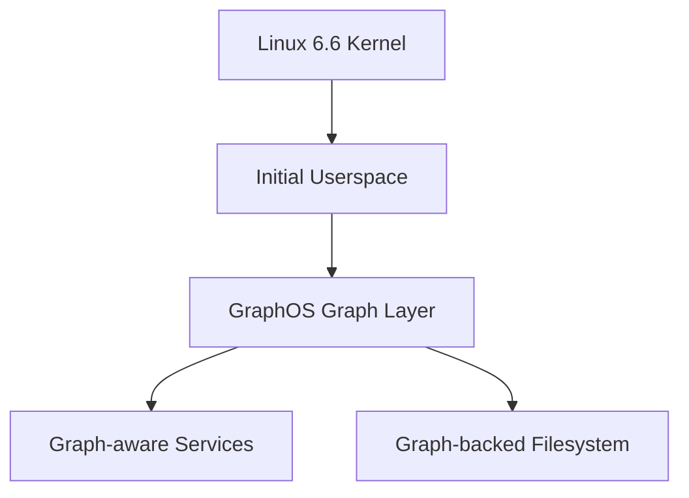
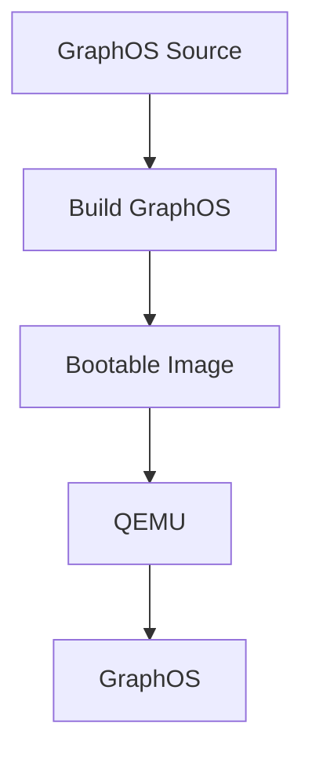

# Linux 6.6 Integration

## 1. Purpose

The initial GraphOS prototype runs primarily in userspace.

The long-term objective is to integrate the GraphOS graph architecture more deeply into the operating system.

Linux 6.6 LTS is the intended kernel foundation for this work.

The integration must be incremental so that the existing Linux functionality can be preserved while GraphOS concepts are introduced.

---

## 2. Integration Strategy

GraphOS should not immediately modify the Linux kernel.

The planned progression is:

The userspace prototype provides a working reference for the graph model before kernel changes are introduced.

---

## 3. Kernel Baseline

Before GraphOS-specific kernel modifications are made, an unmodified Linux 6.6 kernel should be successfully built.

The baseline process is:

The purpose of this baseline is to ensure that later failures can be attributed to GraphOS changes rather than to an incorrect kernel build environment.

---

## 4. Kernel Source Management

The Linux kernel source should remain separate from the GraphOS source repository.

Conceptually:

The complete Linux kernel source tree should not be copied into the GraphOS repository.

Generated kernel build output should also remain outside the main GraphOS source tree whenever practical.

---

## 5. Potential Integration Areas

GraphOS may eventually integrate with several Linux subsystems.

### Virtual Filesystem

The Linux VFS provides the abstraction through which filesystems are accessed.

GraphOS may eventually integrate graph-based filesystem relationships more deeply with the VFS.

---

### Process Management

Linux process structures provide information about:

- Processes
- Threads
- Parent-child relationships
- Process state
- Scheduling

GraphOS may eventually represent these relationships directly within kernel-level graph structures.

---

### Device Management

Devices may eventually become graph nodes.

For example:

---

### Networking

Future GraphOS versions may represent network resources and relationships.

Potential objects include:

- Network interfaces
- Sockets
- Connections
- Network namespaces

Example:

These relationships are future functionality.

---

### Memory Management

Memory resources may eventually be represented in the graph.

Potential relationships include:

The exact representation must be determined through later experimentation.

---

### IPC

GraphOS may eventually represent communication relationships between processes.

For example:

---

## 6. Graph Integration Model

The long-term architecture is intended to expose relationships between multiple classes of operating-system objects through the graph.

The graph should provide a common relationship model without unnecessarily replacing Linux subsystems that already provide required functionality.

---

## 7. Incremental Kernel Development

Kernel integration should proceed through small, testable changes.

Each change should:

1. Have a defined purpose.
2. Modify the smallest practical amount of code.
3. Compile successfully.
4. Pass relevant tests.
5. Preserve existing functionality.
6. Be documented.
7. Be reproducible.

Large architectural changes should be avoided until smaller components have been validated.

---

## 8. Proposed Integration Sequence

A possible sequence is:

The exact order may change as implementation experience is gained.

---

## 9. Kernel Graph Data Structures

A future kernel-level graph implementation may contain concepts equivalent to:

The final kernel representation does not need to exactly match the userspace Graph Core implementation.

The userspace model should serve as the architectural reference.

---

## 10. Kernel Safety

Kernel-level graph functionality must be designed with kernel constraints in mind.

Important considerations include:

- Memory allocation
- Locking
- Concurrency
- Reference counting
- Lifetime management
- Error handling
- Performance
- Deadlock avoidance
- Race conditions

The graph implementation must not introduce unsafe behavior into the kernel.

---

## 11. Concurrency

Unlike the initial userspace prototype, the kernel graph will potentially be accessed concurrently by many processes and kernel subsystems.

Therefore, future graph operations must account for:

Appropriate synchronization mechanisms must be selected during implementation.

---

## 12. Performance

Graph relationships may become numerous on a running system.

The implementation must therefore consider:

- Node lookup performance
- Edge lookup performance
- Memory consumption
- Graph traversal cost
- Update frequency
- Lock contention

The initial prototype should prioritize correctness and clarity.

Performance optimization should follow measurement rather than assumption.

---

## 13. Compatibility

GraphOS is initially based on Linux 6.6.

Existing Linux functionality should remain usable wherever possible.

GraphOS should extend Linux rather than unnecessarily replacing working subsystems.

The exact compatibility requirements will become clearer as kernel integration progresses.

---

## 14. Bootable GraphOS

After sufficient kernel integration, the project should produce a bootable GraphOS environment.

The intended architecture is:

The exact boot architecture will be determined during implementation.

---

## 15. QEMU Validation

QEMU will provide the primary virtual-machine environment for testing the eventual GraphOS system.

The intended flow is:

QEMU allows kernel and operating-system changes to be tested without requiring dedicated hardware.

---

## 16. Development Environment

The development workflow can be represented as:

Windows may be used for source editing and documentation.

Debian is used for Linux-specific compilation and testing.

---

## 17. Initial Scope

The initial Linux integration stage should focus on:

- Establishing a known-good Linux 6.6 build.
- Understanding the relevant Linux subsystems.
- Defining the kernel-side graph architecture.
- Introducing small experimental graph structures.
- Testing process relationships.
- Testing filesystem relationships.
- Maintaining system stability.

---

## 18. Deferred Functionality

The following should not be treated as initial kernel requirements:

- Complete graph representation of every kernel object.
- Full graph-based scheduling.
- Graph-based memory management.
- Graph-based networking.
- Complete device graph.
- Replacement of all Linux kernel subsystems.

These should be introduced incrementally.

---

## 19. Success Criteria

Linux integration is considered successful when:

1. Linux 6.6 builds successfully.
2. GraphOS-specific kernel changes build successfully.
3. The modified kernel boots.
4. Graph data can be created and accessed safely.
5. At least one meaningful Linux subsystem exposes graph relationships.
6. Existing required Linux functionality remains operational.
7. The resulting system can be tested reproducibly in QEMU.

---

## 20. Long-Term Objective

The long-term objective is an operating system in which graph relationships are a fundamental system abstraction.

The desired progression is:

GraphOS should ultimately provide a unified way to represent and reason about relationships between system objects while retaining the reliability and capabilities of the underlying Linux platform.
