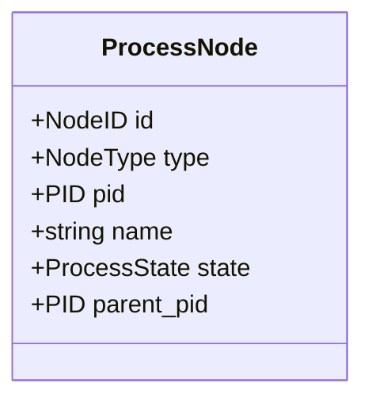
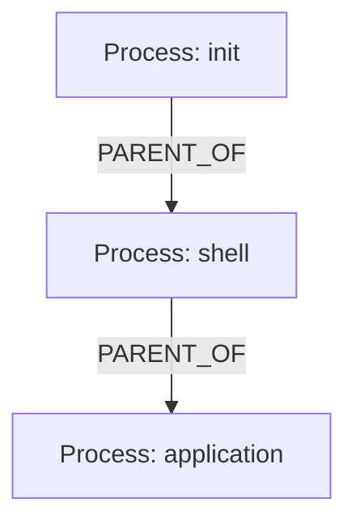
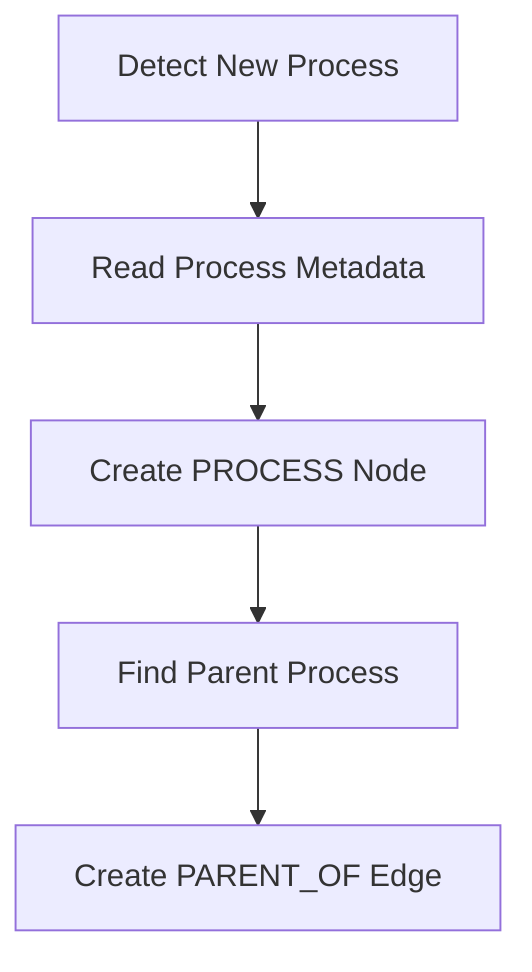
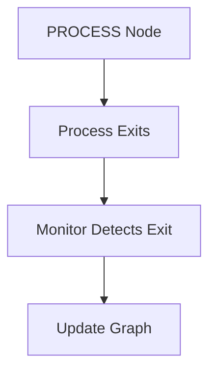
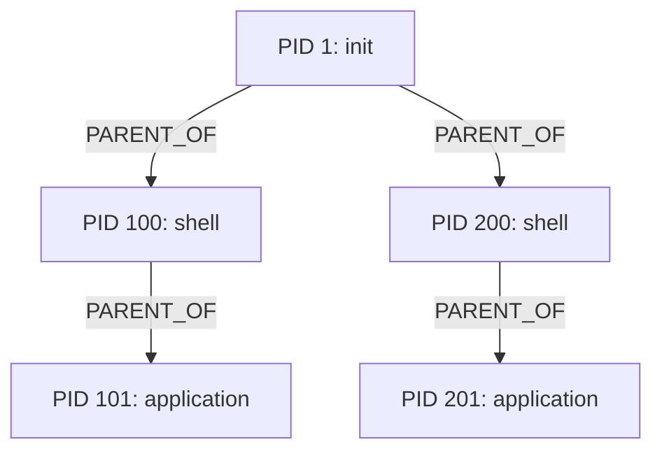
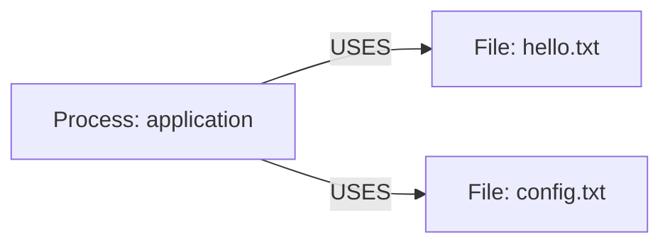
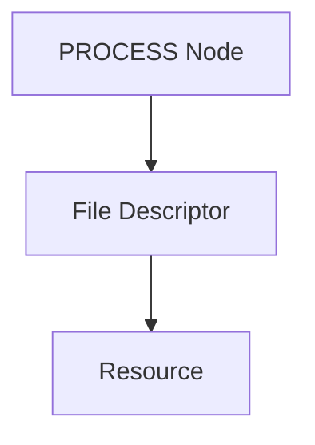
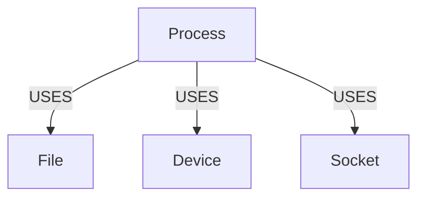
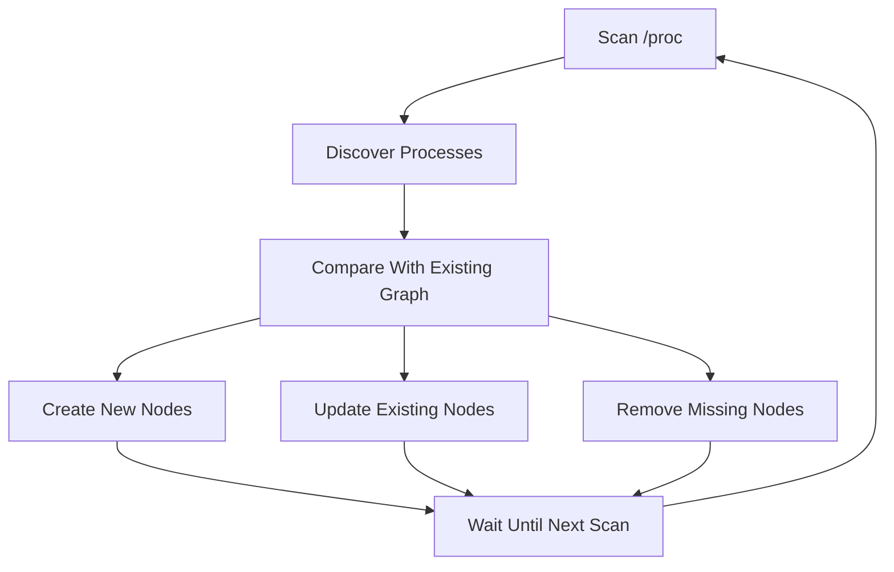
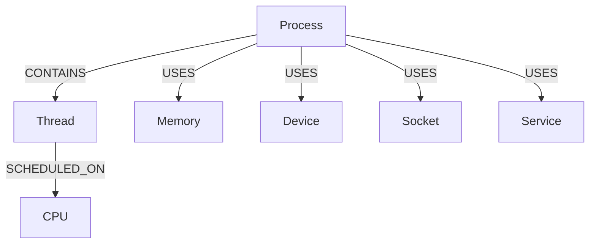

# GraphOS Process Model

## 1. Overview

Processes are represented as graph nodes in GraphOS.

During the initial prototype, process information is obtained from the Linux `/proc` filesystem.

This allows GraphOS to construct a process graph without modifying the Linux kernel during the early development stages.

The process model can later be extended when GraphOS functionality is integrated into the Linux kernel.

---

## 2. Process Representation

Each running process is represented by a node with the type:

```text
PROCESS
```

Conceptually:



The exact implementation fields may evolve as development progresses.

---

## 3. Process Information

The initial process representation should capture at least:

- Process ID (PID)
- Process name
- Process state
- Parent process ID (PPID)

Additional process metadata can be added later.

---

## 4. Process Discovery

The initial process monitor uses the Linux `/proc` filesystem.

The primary process directory is:

```text
/proc
```

Each running process is represented by a directory named using its PID.

For example:

```text
/proc/1
/proc/100
/proc/2500
```

The process monitor can identify numeric directories and treat them as candidate process IDs.

---

## 5. Process Metadata

Information about a process can be obtained from Linux `/proc` interfaces.

One important source is:

```text
/proc/<pid>/stat
```

The process monitor can use this information to obtain values such as:

- PID
- Process name
- Process state
- Parent PID

The implementation should parse only the information required by the current GraphOS process model.

---

## 6. Parent-Child Relationships

Linux processes form a parent-child hierarchy.

GraphOS represents this relationship using the:

```text
PARENT_OF
```

edge type.

Example:



This allows the process hierarchy to be represented directly in the graph.

---

## 7. Process Creation

When a new process is detected, the process monitor should:

1. Identify the process PID.
2. Read the relevant process metadata.
3. Create a PROCESS node.
4. Identify the parent process.
5. Create a `PARENT_OF` relationship when the parent is available.

Conceptually:



---

## 8. Process Termination

When a process exits, its `/proc/<pid>` entry disappears.

The process monitor should detect this change.

The corresponding PROCESS node should then be removed or transitioned into an appropriate historical state, depending on the persistence design.

For the initial prototype, removing the active PROCESS node is sufficient.

Conceptually:



The implementation must avoid leaving stale active process nodes.

---

## 9. Dynamic Process Graph

The process graph is dynamic because processes continuously start and terminate.


The graph therefore changes as the operating system changes.

---

## 10. Process Hierarchy Example

A simplified process hierarchy may look like:



The graph represents relationships rather than simply storing a flat list of processes.

---

## 11. Process-to-File Relationships

Processes may have relationships with files through file descriptors.

The initial process monitor can inspect:

```text
/proc/<pid>/fd/
```

This directory contains symbolic links representing file descriptors associated with a process.

GraphOS can use this information to establish relationships between PROCESS and FILE nodes where appropriate.

Example:



---

## 12. File Descriptor Model

Conceptually:



The initial graph model may represent the relationship directly:


A dedicated file-descriptor node type is not required for the initial prototype.

---

## 13. Process-to-Resource Relationships

The `USES` relationship is intended to represent process interaction with resources.

Initially this may include files.

Later it can be extended to other resources such as:

- Devices
- Sockets
- Network interfaces
- Memory resources
- Other system objects

Example:



Only FILE relationships are required for the initial prototype.

---

## 14. Process Monitor Architecture

The initial process-monitor architecture is:

```mermaid
flowchart TD
    PROC[/proc]
    MONITOR[Process Monitor]
    CORE[Graph Core]
    GRAPH[(Graph)]
    CLI[graphctl]

    PROC -->|Process Information| MONITOR
    MONITOR -->|Create / Update Nodes| CORE
    MONITOR -->|Create Relationships| CORE
    CORE --> GRAPH
    CLI --> CORE
    CORE --> CLI
```

The process monitor should use Graph Core rather than directly modifying internal graph structures.

---

## 15. Monitoring Strategy

The initial implementation may periodically scan `/proc`.

A monitoring cycle can conceptually perform:



The exact monitoring frequency should be determined during implementation and testing.

---

## 16. Consistency Requirements

The process graph should remain consistent with the currently running system as closely as practical.

The implementation should avoid:

- Duplicate PROCESS nodes for the same PID.
- Invalid `PARENT_OF` edges.
- Stale active process nodes.
- Relationships pointing to nonexistent nodes.

Because PIDs can eventually be reused, PID alone should not necessarily be treated as a permanent graph identity.

The implementation should account for this when persistent process history is introduced.

---

## 17. Initial Scope

The initial process model requires:

- Process discovery.
- PID identification.
- Process name.
- Process state.
- Parent process identification.
- `PARENT_OF` relationships.
- Detection of process termination.
- Basic process-to-file relationships.

---

## 18. Deferred Functionality

The following functionality is outside the initial prototype:

- Kernel-level process instrumentation.
- Advanced scheduling information.
- CPU affinity.
- Per-thread graph modeling.
- Detailed memory mappings.
- Advanced IPC relationships.
- Full network relationship modeling.
- Historical process tracking.

These can be introduced during later development.

---

## 19. Future Process Model

The long-term process graph may include additional node types and relationships.



These relationships are future extensions and are not required for the initial prototype.

---

## 20. Success Criteria

The initial process model is considered functional when GraphOS can:

1. Discover running Linux processes.
2. Create PROCESS nodes.
3. Store basic process metadata.
4. Identify parent processes.
5. Create `PARENT_OF` relationships.
6. Detect process termination.
7. Remove or update terminated process nodes.
8. Identify selected process-to-file relationships.
9. Expose the resulting information through `graphctl`.

The resulting graph should change as processes are created and terminated.
