# GraphOS Testing Strategy

## 1. Purpose

Testing is required throughout GraphOS development.

Each subsystem should be tested independently before it is integrated with other components.

The project should distinguish between:

- Unit tests
- Integration tests
- System tests
- Linux validation
- QEMU validation

The objective is to verify both individual components and the relationships between them.

---

## 2. Testing Architecture

The overall testing progression is:

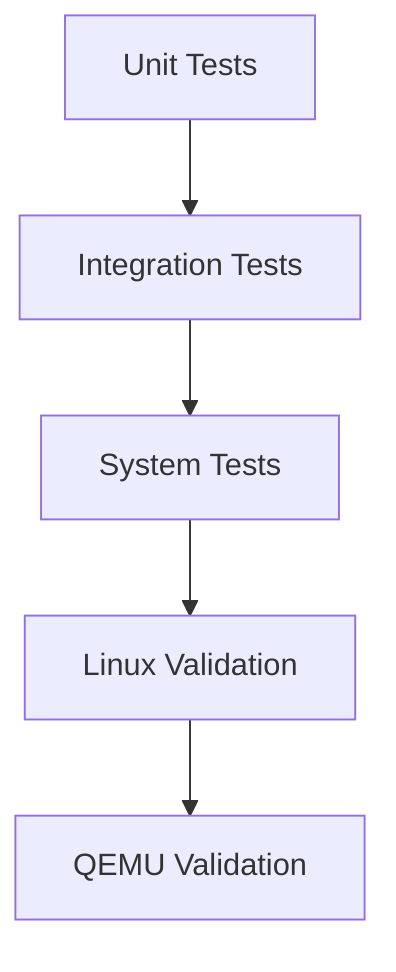

Testing should progress from small components to the complete operating system.

---

# 3. Graph Core Tests

Graph Core is the foundation of the initial GraphOS prototype.

It should therefore have dedicated unit tests.

### Required Tests

- Graph creation
- Graph destruction
- Node creation
- Node deletion
- Edge creation
- Edge deletion
- Node lookup
- Child lookup
- Parent lookup
- Name lookup

---

## 4. Node Creation Test

A basic node test should verify that a node can be created with the required information.

Conceptually:

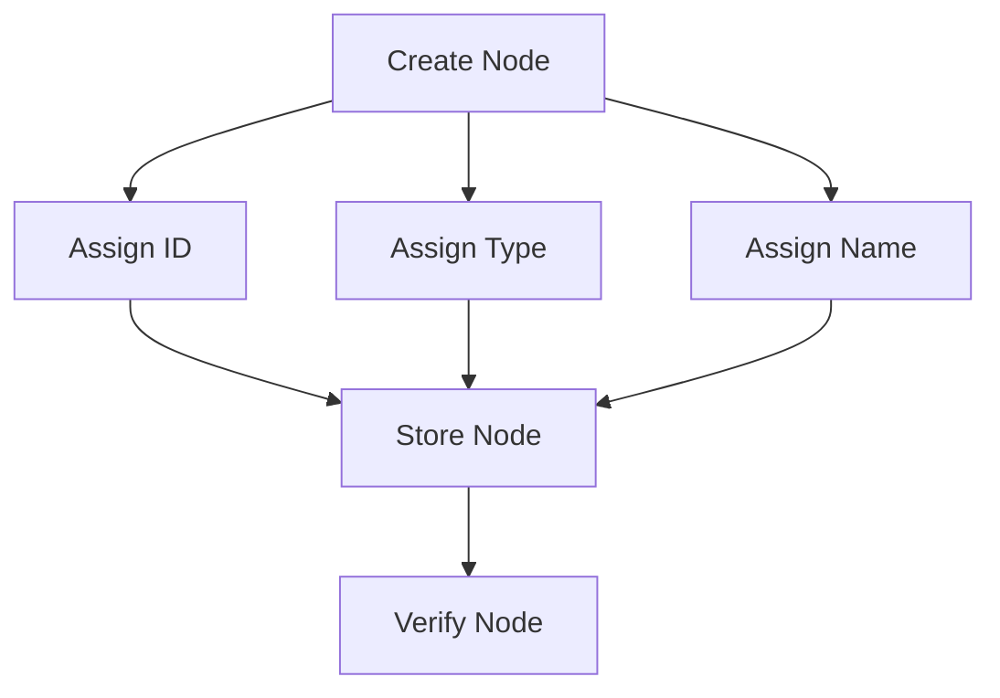

The test should verify that the resulting node can be retrieved from the graph.

---

## 5. Edge Creation Test

An edge test should verify that two existing nodes can be connected.

Example:

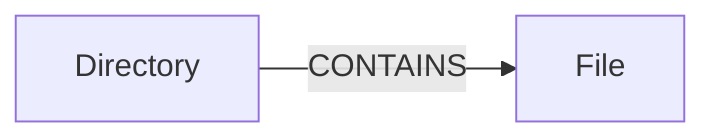

The test should verify:

1. The source node exists.
2. The target node exists.
3. The edge is created.
4. The edge has the correct type.
5. The relationship can be queried.

---

# 6. Graph Relationship Tests

The initial graph relationships should be tested explicitly.

### CONTAINS

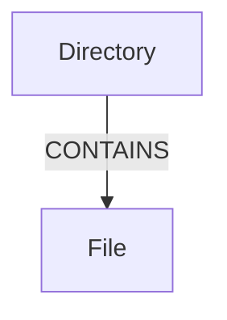

### PARENT_OF

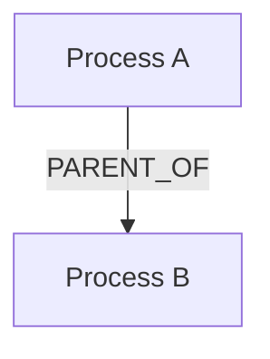

### USES


The tests should verify both creation and lookup of these relationships.

---

# 7. GraphFS Tests

GraphFS should be tested using normal filesystem operations.

The basic test sequence is:

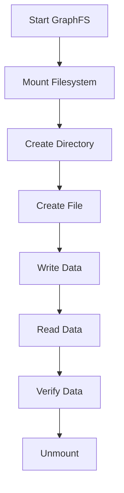

---

## 8. Directory Test

The following operation should create a directory:

```text
mkdir projects
```

The graph should contain:

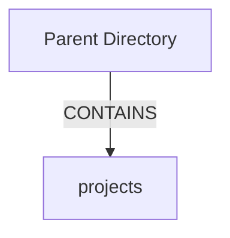

The test should verify both the filesystem result and the corresponding graph relationship.

---

## 9. File Creation Test

The following operation should create a file:

```text
touch projects/hello.txt
```

The graph should contain:

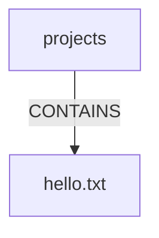

The test should verify that:

- The file exists.
- The FILE node exists.
- The correct `CONTAINS` edge exists.

---

# 10. File Read and Write Tests

The basic file test should:

1. Create a file.
2. Write known data.
3. Read the file.
4. Compare the returned data with the original data.

Example:

```text
echo "GraphOS" > hello.txt
cat hello.txt
```

Expected result:

```text
GraphOS
```

The filesystem result and graph state should remain consistent.

---

# 11. Path Resolution Tests

GraphFS must correctly resolve paths through graph relationships.

For:

```text
/projects/hello.txt
```

the graph should contain:

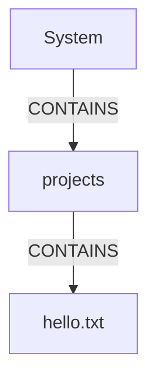

The test should verify that each path component resolves to the correct graph node.

---

# 12. Persistence Tests

Graph persistence must be tested separately.

The basic test sequence is:

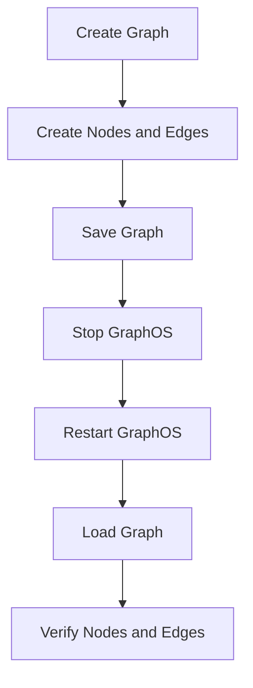

The test should verify that:

- Nodes survive restart.
- Edges survive restart.
- Filesystem relationships survive restart.
- Stored data remains consistent.

---

# 13. graphctl Tests

The `graphctl` interface should be tested against known graph states.

Required commands:

```text
graphctl nodes
graphctl edges
graphctl tree
graphctl info <ID>
```

The test should verify that command output matches the actual graph.

---

## 14. graphctl Integration Test

For example:

```text
mkdir projects
touch projects/hello.txt
```

Then:

```text
graphctl nodes
```

should show corresponding nodes.

And:

```text
graphctl tree
```

should show the filesystem structure.

Conceptually:

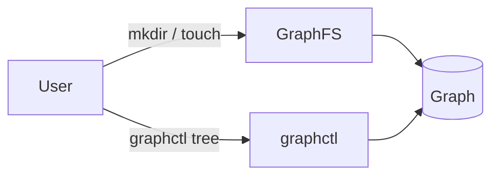

---

# 15. Process Monitor Tests

The process monitor should be tested against the running Linux system.

Required tests include:

- Process discovery.
- PID identification.
- Process name identification.
- Process state identification.
- Parent process identification.
- Process node creation.
- Process termination detection.
- Process node removal or update.

---

# 16. Process Relationship Tests

The process monitor should correctly represent parent-child relationships.

Example:

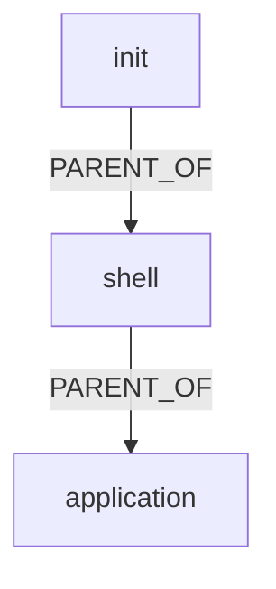

The test should compare the graph relationship with the corresponding Linux process hierarchy.

---

# 17. Process Resource Tests

The initial implementation may inspect:

```text
/proc/<pid>/fd/
```

to identify resources associated with processes.

Example:

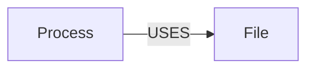

The test should verify that detected relationships correspond to actual process file descriptors where applicable.

---

# 18. Dynamic Graph Tests

The graph must change when the system changes.

For example:

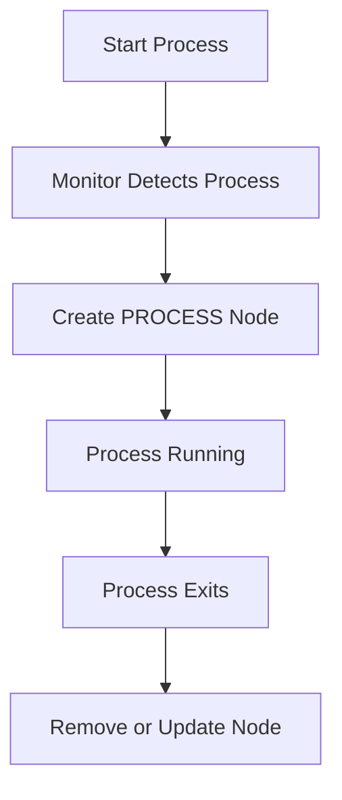

The test should verify that process creation and termination are reflected in the graph.

---

# 19. Consistency Tests

GraphOS should avoid inconsistent graph states.

Tests should check for:

- Duplicate node IDs.
- Duplicate active process nodes.
- Edges pointing to nonexistent nodes.
- Invalid parent relationships.
- Stale process nodes.
- Invalid filesystem relationships.
- Orphaned filesystem objects.

---

# 20. Error Handling Tests

Each subsystem should be tested with invalid input.

Examples include:

```text
Invalid node ID
Missing file
Missing directory
Invalid path
Missing parent node
Invalid edge
Duplicate node
Duplicate relationship
```

The system should return a controlled error rather than crashing.

---

# 21. Regression Testing

When existing functionality is changed, previously working tests should be executed again.

Important regression areas include:

- Graph creation
- Graph lookup
- Graph persistence
- Filesystem operations
- Path resolution
- graphctl
- Process monitoring

A change to Graph Core can affect multiple other components and therefore requires integration testing.

---

# 22. Linux Validation

Linux-specific functionality must be compiled and tested on Linux.

Windows source editing or GitHub repository validation does not prove that Linux-specific functionality works.

The Debian development environment should be used for:

- C compilation
- Graph Core tests
- FUSE compilation
- GraphFS mounting
- GraphFS filesystem tests
- `/proc` process monitoring
- Integration testing
- Linux kernel compilation

---

# 23. Kernel Testing

When Linux kernel integration begins, every kernel modification should first be tested independently.

The basic progression is:

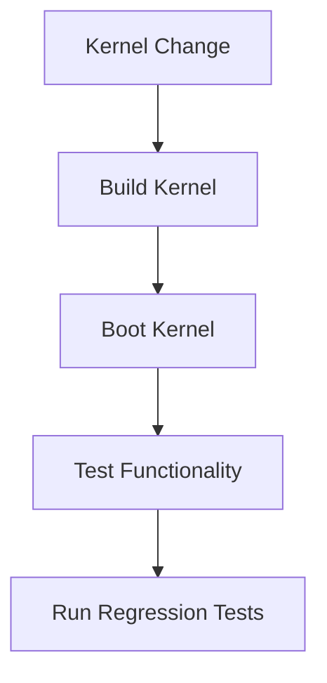

A kernel change should not be considered complete merely because compilation succeeds.

---

# 24. QEMU Testing

Once GraphOS becomes bootable, QEMU will provide the primary virtual-machine testing environment.

The basic flow is:

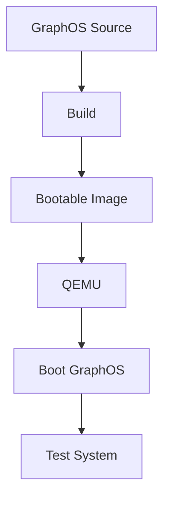

QEMU testing should verify:

- Kernel boot
- Initial userspace
- Graph initialization
- Filesystem availability
- GraphOS services
- Process representation
- System stability

---

# 25. Test Environments

GraphOS testing will use multiple environments.

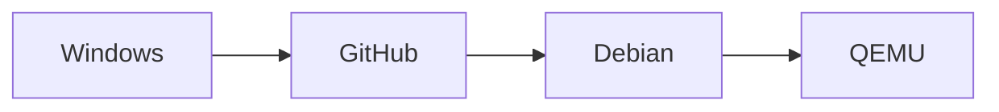

### Windows

Primarily used for:

- Documentation
- Source editing
- GitHub interaction
- Code review

### GitHub

Used for:

- Source control
- Documentation
- Collaboration
- Change history

### Debian

Used for:

- Linux compilation
- FUSE development
- GraphFS testing
- `/proc` testing
- Kernel development

### QEMU

Used for:

- Boot testing
- Kernel testing
- Full GraphOS system testing

---

# 26. Milestone Validation

A development milestone should not be considered complete until its documented functionality can be demonstrated in the intended environment.

For example, GraphFS should not be considered complete merely because its source code compiles.

It should be:

1. Compiled.
2. Mounted.
3. Used through normal filesystem operations.
4. Tested against the graph.
5. Tested for persistence.
6. Tested after restart.

---

# 27. Initial Prototype Acceptance Criteria

The first major GraphOS prototype should satisfy the following:

### Graph Core

- Nodes can be created and deleted.
- Edges can be created and deleted.
- Nodes and relationships can be queried.
- Graph state can be persisted.

### GraphFS

- GraphFS can mount.
- Directories can be created.
- Files can be created.
- Files can be read.
- Files can be written.
- Files can be renamed.
- Files can be deleted.
- Graph relationships correspond to filesystem operations.

### graphctl

- Nodes can be listed.
- Edges can be listed.
- The graph tree can be displayed.
- Individual nodes can be inspected.

### Process Monitor

- Processes can be discovered.
- Process nodes can be created.
- Parent-child relationships can be represented.
- Process termination can be detected.
- Basic process-resource relationships can be represented.

---

# 28. Testing Philosophy

The GraphOS testing strategy follows four principles:

### Correctness Before Performance

The initial implementation should prioritize correct graph relationships and predictable behavior.

### Test Small Components First

Graph Core should be tested before GraphFS depends on it.

### Test Real Linux Behavior

Linux-specific functionality must eventually be validated on Linux.

### Test the Complete System

As GraphOS develops, individual tests must be supplemented by integration and QEMU system tests.

---

# 29. Long-Term Testing Goal

The long-term testing architecture should validate the complete system:

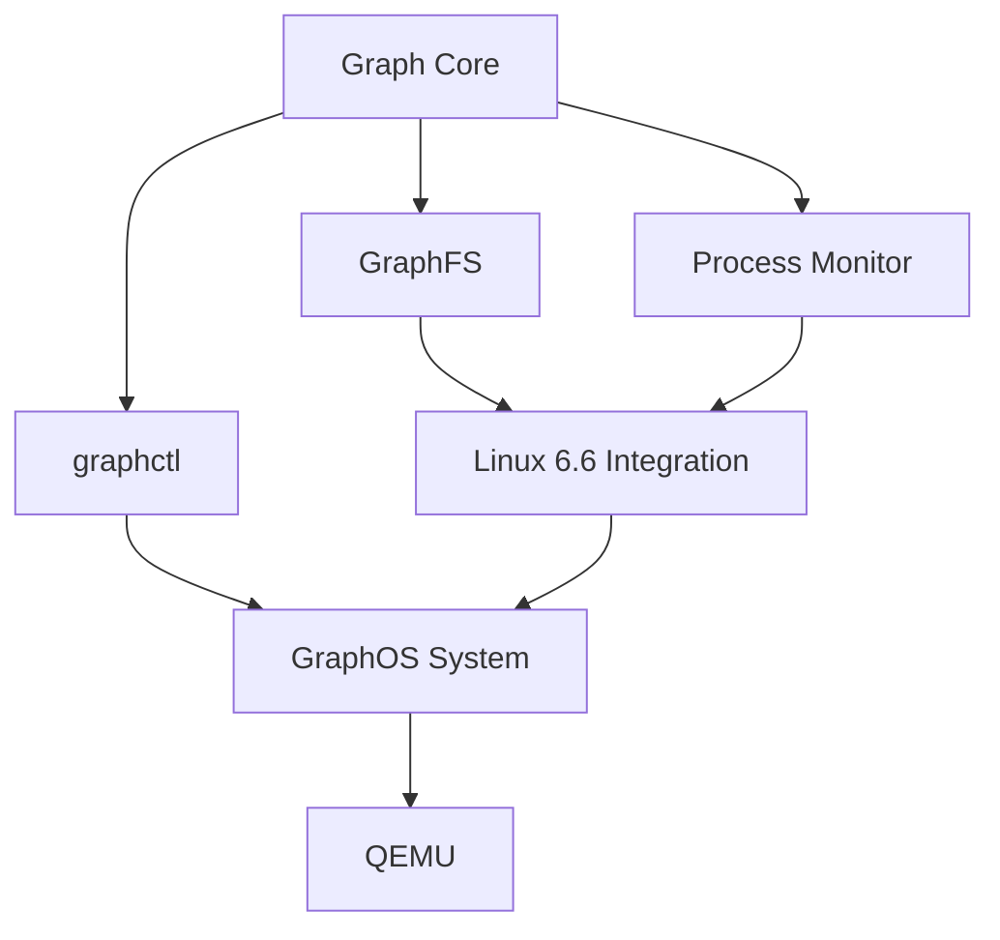

The objective is to ensure that graph-based behavior remains correct as GraphOS moves from a userspace prototype toward a complete operating system.
